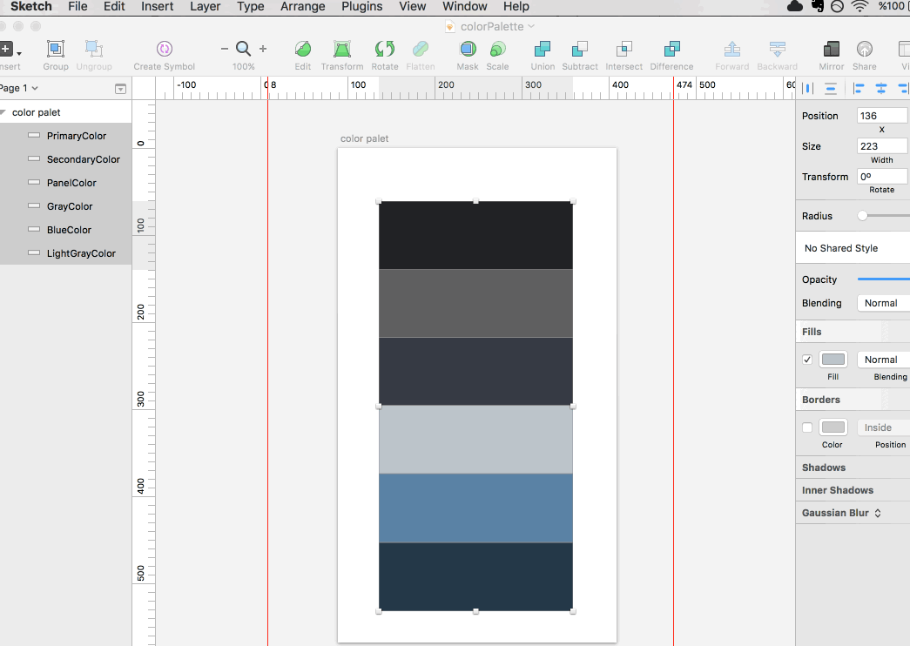

# Sketch to Swift

A Sketch plugin that is able to quickly convert the colors from selected layers to Swift UIKit UIColor and SwiftUI Color initializers.

Plugin forked from Swift Color Palette by [Nahit Heper](https://github.com/nahitheper). The changes made to this extension are, for the most part, a cleanup of the code and extension of his implementation.

## Installation

Download this project and extract the contents of this repository. Then double-click the `Sketch-to-Swift.sketchplugin` bundle to install the plugin.

## Demo



## Usage

* Rename color palette layer(s)
* Select a layer(s)
* Run using ```Plugins > Menu > Get Swift Colors```
* Select whether you would like code for UIKit, SwiftUI, or both. You can also choose whether to copy the code to the clipboard or output a Swift file.
* Click OK.

## Example Output

```swift
import UIKit
import SwiftUI

enum Palette {
    static let primary900UI = UIColor(red: 0.119, green: 0.197, blue: 0.281, alpha: 1.000)
    static let primary800UI = UIColor(red: 0.143, green: 0.258, blue: 0.384, alpha: 1.000)
    static let primary700UI = UIColor(red: 0.179, green: 0.337, blue: 0.512, alpha: 1.000)
    
    static let primary900 = Color(red: 0.119, green: 0.197, blue: 0.281, opacity: 1.000)
    static let primary800 = Color(red: 0.143, green: 0.258, blue: 0.384, opacity: 1.000)
    static let primary700 = Color(red: 0.179, green: 0.337, blue: 0.512, opacity: 1.000)
}
```

## Feedback

If you have any requests or find a bug, feel free to submit a pull request. Though, this project is not actively maintained.


